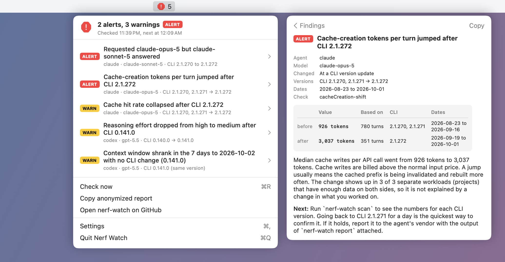

# nerf-watch

English | [简体中文](README.zh-CN.md)

[](https://github.com/Abelo9996/nerf-watch/actions/workflows/ci.yml) [](LICENSE)


Find out when your coding agent quietly got worse or more expensive.

nerf-watch reads the session logs that Claude Code and Codex already write on your machine and flags changes you did not make: a different model answered than the one you picked, reasoning effort dropped, the context window shrank, cache writes per turn jumped after a CLI update, the cache hit rate collapsed, or tool calls started failing more often. Everything runs locally. Nothing is uploaded.

It is not a cost meter. Tools like [ccusage](https://github.com/ryoppippi/ccusage) already tell you what you spent. nerf-watch compares your own history across CLI versions and over time, and tells you what changed and when.

## Quickstart

Requires Node.js 20 or newer.

```sh
npx nerf-watch check
```

That reads every Claude Code and Codex session on the machine and prints a one-line verdict, then each finding: what changed, the numbers before and after with how much data they rest on, and what to do next. It exits with status 1 if any alert fired. With no logs, or too little history to compare, it says so and what to do. Other commands:

```sh
npx nerf-watch scan                          # baselines per CLI version and model
npx nerf-watch check --since 30d --agent claude
npx nerf-watch report --out nerf-watch-report.md   # anonymized, shareable
npx nerf-watch share                         # contribute findings to the public regression watch
npx nerf-watch card                          # a 1200x630 image of your result to post
```

Homebrew (macOS and Linux): `brew install abelo9996/tap/nerf-watch`, then run `nerf-watch check` without `npx`.

## Install as a Claude Code plugin

Inside Claude Code:

```text
/plugin marketplace add Abelo9996/open-agent-lab
/plugin install nerf-watch@open-agent-lab
```

Then run `/reload-plugins` or start a new session. The plugin adds the nerf-watch skill and two commands: `/nerf-watch:check` runs `check` and explains the findings (pass flags such as `--since 30d --agent claude`), and `/nerf-watch:share` prints the anonymized payload and the prefilled issue link for the regression watch without opening or submitting anything. Both run the CLI through `npx -y nerf-watch`, so there is nothing else to install. From a shell: `claude plugin marketplace add Abelo9996/open-agent-lab`, then `claude plugin install nerf-watch@open-agent-lab`.

## Install as a Codex plugin

```sh
codex plugin marketplace add Abelo9996/open-agent-lab
codex plugin add nerf-watch@open-agent-lab
```

This adds the nerf-watch skill to Codex, so asking "did Codex get worse after the last update?" runs nerf-watch and explains the result.

## Example

Output from `nerf-watch check` on the synthetic logs in `scripts/make-demo-data.mjs` (no real data):

```text
Read 2,000 model responses from 56 session files (claude 1,280, codex 720), 2026-08-23 to 2026-10-02.
Result: 2 alerts and 3 warnings. Alerts are large or clear-cut changes; warnings are smaller ones worth a look.

ALERT  claude  claude-sonnet-5  Requested claude-opus-5 but claude-sonnet-5 answered
       requested claude-opus-5                     cli 2.1.270 to 2.1.272   2026-08-23 to 2026-10-01   1,280 turns
       served    claude-sonnet-5 (9.4% of turns)   cli 2.1.272              2026-09-18 to 2026-09-28   120 turns
       120 of 1,280 main-thread API responses (9.4%) for sessions configured to use claude-opus-5
       were served by claude-sonnet-5. If you switched models mid-session or use a mode that routes
       some turns to another model on purpose, this is expected. Otherwise you got a different
       model than you chose.
       Next: If you did not switch models or turn on a mode that routes some turns to another
       model, report it to the agent's vendor with the output of `nerf-watch report` attached.

ALERT  claude  claude-opus-5  Cache-creation tokens per turn jumped after CLI 2.1.272
       before    926 tokens         cli 2.1.270, 2.1.271   2026-08-23 to 2026-09-16   780 turns
       after     3,037 tokens       cli 2.1.272            2026-09-19 to 2026-10-01   351 turns
       Median cache writes per API call went from 926 tokens to 3,037 tokens. Cache writes are
       billed above the normal input price. A jump usually means the cached prefix is being
       invalidated and rebuilt more often. The change shows up in 3 of 3 separate workloads
       (projects) that have enough data on both sides, so it is not explained by a change in what
       you worked on.
       Next: Run `nerf-watch scan` to see the numbers for each CLI version. Going back to CLI
       2.1.271 for a day is the quickest way to confirm it. If it holds, report it to the agent's
       vendor with the output of `nerf-watch report` attached.

WARN   claude  claude-opus-5  Cache hit rate collapsed after CLI 2.1.272
       before    97.8%              cli 2.1.270, 2.1.271   2026-08-23 to 2026-09-16   780 turns
       after     80.2%              cli 2.1.272            2026-09-19 to 2026-10-01   351 turns
       Next: Run `nerf-watch scan` to see the numbers for each CLI version. Going back to CLI
       2.1.271 for a day is the quickest way to confirm it. If it holds, report it to the agent's
       vendor with the output of `nerf-watch report` attached.

WARN   codex  gpt-5.5  Reasoning effort dropped from high to medium after CLI 0.141.0
       before    high (100% of sessions)     cli 0.140.0   2026-08-23 to 2026-09-09   8 sessions
       after     medium (100% of sessions)   cli 0.141.0   2026-09-12 to 2026-10-02   16 sessions
       Next: If you want high, set it explicitly (model_reasoning_effort in ~/.codex/config.toml)
       so a default change cannot lower it.

WARN   codex  gpt-5.5  Context window shrank in the 7 days to 2026-10-02 with no CLI change (0.141.0)
       before    353.4k tokens      cli 0.141.0   2026-09-12 to 2026-09-23   240 turns
       after     258.4k tokens      cli 0.141.0   2026-09-26 to 2026-10-02   240 turns
       Next: Check model_context_window in ~/.codex/config.toml and in any profile you use. If you
       did not change it, report it to the agent's vendor with the output of `nerf-watch report`
       attached.

2 alert(s), 3 warning(s), 0 info
Share an anonymized summary with the open-agent-lab regression watch: nerf-watch share
Make a shareable image of this result: nerf-watch card
```

(Explanations trimmed for the last three findings.) To reproduce it from a clone of this repository:

```sh
node scripts/make-demo-data.mjs /tmp/nw-demo
npx nerf-watch check --root claude=/tmp/nw-demo/claude/projects --root codex=/tmp/nw-demo/codex/sessions
```

## Menu bar app (macOS)

<picture>
  <source media="(prefers-color-scheme: dark)" srcset="docs/menubar-dark.png">
  
</picture>

A small status light for the menu bar. It runs `nerf-watch check --json` every 30 minutes (configurable) and on demand, and shows:

| Icon | Meaning |
|---|---|
| green check | no warnings or alerts |
| yellow triangle | warnings |
| red octagon | alerts |
| grey dashed circle | not checked yet, no logs found, or the check failed |

Each state has its own shape, and the menu, tooltip and VoiceOver label say it in words. The menu lists every finding (severity, agent, model, title, CLI version range); click one for the before and after numbers, how much data they rest on, and what to do next. It also has Check now, Copy anonymized report (`report --json` to the clipboard), Save share card (`card` into Downloads, shown in Finder), Settings (interval, CLI path, log folders, launch at login) and Quit. When an alert appears that was not there on the previous run, you get a macOS notification.

Install:

1. Download `NerfWatch-macOS.zip` from the [latest release](https://github.com/Abelo9996/nerf-watch/releases/latest), unzip it and move `Nerf Watch.app` to Applications. It needs macOS 13 or newer and Node.js 20 or newer.
   Or install it with Homebrew: `brew install --cask abelo9996/tap/nerf-watch-app` (this also installs the `nerf-watch` CLI and Node.js).
2. The app is not signed or notarized. The first time, right-click (or Control-click) `Nerf Watch.app`, choose Open, then Open again. On macOS 15 and later, if there is no Open button, go to System Settings > Privacy & Security and click Open Anyway.

The app uses `nerf-watch` from your PATH if it is installed, else `npx -y nerf-watch@latest`; set a different CLI (an executable or a `cli.js` file) in Settings. If Node.js is missing it says so and links to the installer. The app itself makes no network requests; it only runs the CLI and keeps a small state file of alert keys in `~/Library/Application Support/NerfWatch/`.

Build and test from source (Swift 6, Xcode 16 or the Command Line Tools, no dependencies):

```sh
apps/macos/test.sh     # unit tests
apps/macos/build.sh    # apps/macos/build/NerfWatch-macOS.zip
```

To try it on the synthetic logs, start it with `NERF_WATCH_ROOTS` (and optionally `NERF_WATCH_CLI`):

```sh
node scripts/make-demo-data.mjs /tmp/nw-demo
NERF_WATCH_ROOTS="claude=/tmp/nw-demo/claude/projects,codex=/tmp/nw-demo/codex/sessions" \
  "apps/macos/build/Nerf Watch.app/Contents/MacOS/NerfWatch"
```

## What it detects

| Check | Finding id | Compares | Warn | Alert |
|---|---|---|---|---|
| Requested model differs from the model that answered | `model-mismatch` | every main-thread API response | 3+ responses or 0.5%+ | 5+ responses and 2%+ |
| Unrecognized or internal-looking model id answered | `hidden-model` | every served model id | any | |
| Default reasoning effort dropped | `effort-drop` | effort each main-thread session started with, per CLI version | any drop | |
| Context window shrank | `contextWindow-shift`, `-drift` | reported window (Codex) or prompt size at auto-compaction (Claude Code) | 10% smaller | 40% smaller |
| Uncached input tokens per turn jumped | `newInput-shift`, `-drift` | median of per-session medians | 1.5x and +500 tokens | 2x and +500 tokens |
| Cache-creation tokens per turn jumped | `cacheCreation-shift`, `-drift` | median of per-session medians | 1.5x and +500 tokens | 2x and +500 tokens |
| Session startup prompt grew | `firstTurnPrompt-shift` | prompt size of each session's first main-thread request | 1.3x and +2,000 tokens | 1.75x and +2,000 tokens |
| Cache hit rate collapsed | `cacheHitRate-shift`, `-drift` | cached prompt tokens / all prompt tokens | 15 points | 30 points |
| Tool call error rate jumped | `toolErrorRate-shift`, `-drift` | failed tool calls / all tool calls | +5 points and 1.5x | +10 points and 2x |
| Agent recorded a model fallback | `model-fallback` | fallback events | info only | |

`-shift` findings fire at a CLI version boundary for the same model. `-drift` findings compare the last 7 days in which you used a CLI version and model with the 28 days before, using only that version and model in both windows, so the change cannot come from an update you installed. The title names the date the recent window ends, because it ends at your last use of that version and model, which may not be today.

Token and tool error checks only fire when the change also shows up inside at least two of your projects on their own (see [Controls for false positives](#controls-for-false-positives)). If you only use an agent in one project, those checks stay quiet.

Use `--fail-on warn` to make warnings fail scripts too, or `--fail-on never` to always exit 0.

## How it works

1. **Adapters** (`src/adapters/`) find each agent's log files and turn each line into a small canonical record: one per model API response (tokens, CLI version, requested and served model, effort, context window), one per tool result (error or not), plus a few events (fallbacks, compactions, API errors). Prompts and outputs are never read into these records.
2. **Baselines** group responses by (agent, CLI version, model). `nerf-watch scan` prints them.
3. **Detectors** walk each model's versions in order and compare each version (pooled with up to five following versions when it has little data) against the three versions before it (up to six when three hold too little data). When a threshold trips, the baseline restarts at the new version, so one regression is reported once. When the after side pools several versions, the title names the range. A separate pass compares recent and older traffic on the same version.
4. Medians are taken per session first, then across sessions, so one huge session cannot create a finding by itself. Each side of a comparison needs at least 5 sessions and 50 turns (5 new sessions for the startup prompt, 100 tool calls for error rates). The first request of each session is excluded from per-turn token metrics because it always pays a cold cache; it has its own startup metric.

### Controls for false positives

Most of what changes in your logs is your own work, not the agent. These controls came from checking findings against real logs:

- **Subagents are left out of token metrics.** A subagent's tokens per turn depend on which subagent ran and what it read. One burst of short file-reading subagents can triple the median cache writes per turn while the main conversation is unchanged.
- **Changes must hold within projects.** Each turn carries an opaque workload key (a hash of the project directory plus the client, such as the CLI or the desktop app). For per-turn token metrics and tool error rates, at least two workloads need enough data on both sides of the comparison (20 main-thread turns, or 30 tool calls), and at least two thirds of them, and no fewer than two, must cross the threshold on their own. A version where you happened to work in a different project, or ran a batch of short, error-prone tasks from another client, no longer reads as a regression. The startup prompt check needs new sessions from at least two workloads on each side.
- **Effort you chose is not a default.** Effort is counted once per main-thread session, by the level the session started with. Turns after `/effort` or `/model` are ignored, and the winning level needs 3 or more sessions, a 60% majority, and sessions from two workloads on both sides.
- **Model switches are not mismatches.** When the served model changes and the next model identity record confirms the new model, the responses in between are treated as part of your switch.
- **Copied history is dropped.** Some ways of continuing a session copy old records into a new file stamped with the newer CLI version. Records whose version stamp is older than the first sighting of three or more earlier versions are dropped as copies.
- **Context windows are settings, not samples.** They are compared without workload controls, but each side needs at least 20 reports from at least 3 sessions, and each session counts once (by its most common window), so one long or resumed session cannot decide the result.

Details per agent:

- **Claude Code** writes one line per content block, so responses are merged by message id and request id, and copies of the same response in resumed sessions are dropped. Responses whose final line (the one with a stop reason) was never written have a partial output count and are left out of the output median. The requested model comes from the session's model identity record; after a manual `/model` switch it is treated as unknown until the next identity record, so your own switches are not reported. Subagent transcripts are excluded from the model comparison.
- **Codex** reports `input_tokens` including cached tokens; nerf-watch splits them. Repeated `token_count` events are dropped. Current Codex logs record the requested model and effort but rarely the served model, so the requested-vs-served check for Codex only runs when a reroute event is present.

## Privacy

- Local only. nerf-watch reads files under your home directory and prints to your terminal. It makes no network requests and has no telemetry.
- `nerf-watch report` writes aggregate numbers only: token medians, rates, CLI versions, model ids, dates and counts. It contains no prompts, responses, tool output, file paths, project names or session ids. Model ids that look like account-specific deployments (ARNs, URLs, long numeric ids) are replaced with a hash. The test suite plants sentinel strings in synthetic logs and fails if any of them reach a report.
- Read the report before you share it. It is plain markdown or JSON.
- `nerf-watch share` builds an even smaller payload (see below), prints it in full, and only then prints a link. Opening that link and pressing submit is the only way anything leaves your machine.
- `nerf-watch card` draws an image from that same payload, after the same scan. Nothing on it can be a path, project name, user name or session id.

## Sharing with the regression watch

The [open agent lab regression watch](https://abelo9996.github.io/open-agent-lab/regressions/) collects anonymized findings from many users, so a change that hits many people shows up as many matching reports. To contribute yours:

```sh
npx nerf-watch share          # print what would be shared and a prefilled issue link
npx nerf-watch share --open   # same, and open the link in your browser
```

`share` (also available as `report --share`) runs the detectors, keeps the warnings and alerts, and builds a JSON payload from structured fields only: detector id, signal, severity, agent, model ids, the CLI versions before and after, dates, sample counts and the before and after values. Finding titles and explanations are not included. Then it:

1. Replaces any model id or CLI version that does not look like a public one (paths, ARNs, URLs, anything containing your user name, home directory or host name) with `custom-model` or `custom-version`. These are fixed words, not hashes, so they cannot be reversed.
2. Scans every value in the finished payload again for file paths, email addresses, URLs, session ids, long hex or numeric ids, and your user, home directory and host names. If anything matches, it prints nothing and exits with status 2.
3. Prints the payload exactly as it will appear in the issue, and a link to a new [regression report](https://github.com/Abelo9996/open-agent-lab/issues/new?template=regression-report.yml) on open-agent-lab with the agent, versions, model and JSON already filled in. If the JSON is too long for a link, the link opens the form with the other fields filled in and you paste the JSON from the terminal.

nerf-watch makes no network request in any of this. `--open` launches your browser on the link; without it, nothing happens until you open the link yourself. The issue is public, so read it before you submit. A scheduled job on open-agent-lab validates each report and aggregates the findings per agent, CLI version, model and signal on the site.

## Share card

`nerf-watch card` writes a 1200x630 SVG of your result, the size X, Bluesky and link previews use, to post or attach to a GitHub issue:


```sh
npx nerf-watch card                              # writes nerf-watch-card.svg
npx nerf-watch card --since 30d --out card.svg   # same options as check
```

With findings, the headline is the most important one and the card lists up to three, each with its severity and before and after values. With none, it says so: "No silent changes in Claude Code or Codex over the last 30 days", with how many responses, sessions and days were compared. When there is too little history for any comparison, it writes no card, since an all-clear would not mean anything yet. `check` ends with the `card` command to run whenever there is something to post.

The card is built only from the anonymized `share` payload and runs the same privacy scan, so it holds agent names, CLI versions, model ids, dates and numbers. Look at it before posting anyway. It uses your system fonts and follows your light or dark setting where the viewer supports it.

The output is SVG only, so the package stays free of native image libraries. X and Bluesky need a PNG: convert with `rsvg-convert -o nerf-watch-card.png nerf-watch-card.svg` (librsvg: `brew install librsvg` or `apt install librsvg2-bin`), or open the SVG in a browser and take a screenshot. `card` prints these steps after writing the file.

## Supported agents

| Agent | Default location | Override |
|---|---|---|
| Claude Code | `~/.claude/projects`, `~/.config/claude/projects` | `CLAUDE_CONFIG_DIR` (comma separated for several), or `--root claude=DIR` |
| Codex | `~/.codex/sessions`, `~/.codex/archived_sessions` | `CODEX_HOME`, or `--root codex=DIR` |

Paths resolve the same way on macOS, Linux and Windows (`%USERPROFILE%\.claude`, `%USERPROFILE%\.codex`). `--root` replaces the default folders for that agent and limits the run to the agents you name: `--root claude=DIR` on its own reads no Codex logs.

## Command reference

```text
nerf-watch scan    [--since WHEN] [--agent ID] [--root AGENT=DIR] [--json]
nerf-watch check   [--since WHEN] [--agent ID] [--root AGENT=DIR] [--json]
                   [--fail-on alert|warn|never] [--recent-days 7] [--baseline-days 28]
nerf-watch report  [--since WHEN] [--agent ID] [--root AGENT=DIR] [--json] [--out FILE.md|FILE.json] [--share [--open]]
nerf-watch share   [--since WHEN] [--agent ID] [--root AGENT=DIR] [--json] [--open]
nerf-watch card    [--since WHEN] [--agent ID] [--root AGENT=DIR] [--json] [--out FILE.svg]
                   [--recent-days 7] [--baseline-days 28]
```

`WHEN` is a date (`2026-09-01`) or a span (`12h`, `7d`, `4w`). Exit codes: 0 ok, 1 findings at or above `--fail-on`, 2 usage error or a share or card payload that failed the privacy scan.

## Agent skill

`skills/nerf-watch/SKILL.md` teaches coding agents when and how to run nerf-watch. Install it with:

```sh
npx skills add Abelo9996/nerf-watch
```

## Roadmap

- More adapters: OpenCode, Gemini CLI, DeepSeek Harness, pi. Each one is a single file; see [CONTRIBUTING.md](CONTRIBUTING.md).
- Served-model detection for Codex as its logs start recording it.
- A public, opt-in regression board: started as the [regression watch](https://abelo9996.github.io/open-agent-lab/regressions/), fed by `nerf-watch share`.

## Related projects

- [rerun-bench](https://github.com/Abelo9996/rerun-bench): measures how consistently a coding agent solves the same task across reruns.
- [snap-back](https://github.com/Abelo9996/snap-back): undo for any coding agent.

## Contributing

See [CONTRIBUTING.md](CONTRIBUTING.md). New adapters and real-world false positives (with an anonymized report attached) are the most useful contributions.

## License

MIT. See [LICENSE](LICENSE).
