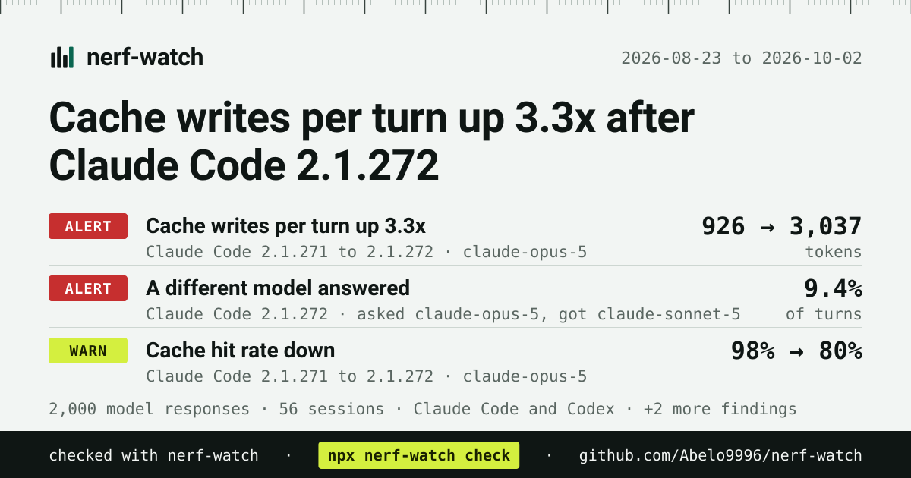

# nerf-watch

[English](README.md) | 简体中文

[](https://github.com/Abelo9996/nerf-watch/actions/workflows/ci.yml) [](LICENSE)


当你的编程智能体悄悄变差或变贵时，第一时间知道。

nerf-watch 读取 Claude Code 和 Codex 本来就会写在你本机上的会话日志，找出那些不是你自己做的改动：实际回答的模型和你选的不一样、推理强度（reasoning effort）被调低、上下文窗口变小、CLI 更新后每轮的缓存写入量暴涨、缓存命中率断崖式下跌，或者工具调用的失败率变高。所有分析都在本地完成，不上传任何数据。

它不是费用统计工具。[ccusage](https://github.com/ryoppippi/ccusage) 这类工具已经能告诉你花了多少钱。nerf-watch 做的是把你自己的历史数据按 CLI 版本、按时间进行对比，告诉你哪里变了、什么时候变的。

## 快速开始

需要 Node.js 20 或更高版本。

```sh
npx nerf-watch check
```

这条命令会读取本机上所有 Claude Code 和 Codex 会话，打印出发生了哪些变化；只要有任何告警触发，就以状态码 1 退出。其他命令：

```sh
npx nerf-watch scan                          # baselines per CLI version and model
npx nerf-watch check --since 30d --agent claude
npx nerf-watch report --out nerf-watch-report.md   # anonymized, shareable
npx nerf-watch share                         # contribute findings to the public regression watch
npx nerf-watch card                          # a 1200x630 image of your result to post
```

Homebrew（macOS 和 Linux）：`brew install abelo9996/tap/nerf-watch`，之后直接运行 `nerf-watch check`，无需 `npx`。

## 作为 Claude Code 插件安装

在 Claude Code 里运行：

```text
/plugin marketplace add Abelo9996/open-agent-lab
/plugin install nerf-watch@open-agent-lab
```

然后运行 `/reload-plugins` 或开一个新会话。插件会加入 nerf-watch skill 和两个命令：`/nerf-watch:check` 运行 `check` 并解释结果（可以带上 `--since 30d --agent claude` 这类参数）；`/nerf-watch:share` 打印匿名化的内容和回归观察站的预填 issue 链接，不会打开或提交任何东西。两者都通过 `npx -y nerf-watch` 运行 CLI，不需要另外安装。在终端里也可以：`claude plugin marketplace add Abelo9996/open-agent-lab`，然后 `claude plugin install nerf-watch@open-agent-lab`。

## 作为 Codex 插件安装

```sh
codex plugin marketplace add Abelo9996/open-agent-lab
codex plugin add nerf-watch@open-agent-lab
```

这会给 Codex 加入 nerf-watch skill，问它“上次更新之后 Codex 是不是变差了？”时，它会运行 nerf-watch 并解释结果。

## 示例

下面是 `nerf-watch check` 在 `scripts/make-demo-data.mjs` 生成的合成日志上的输出（不含任何真实数据）：

```text
Read 2,000 model responses from 56 session files (claude 1,280, codex 720), 2026-08-23 to 2026-10-02.
Result: 2 alerts and 3 warnings. Alerts are large or clear-cut changes; warnings are smaller ones worth a look.

ALERT  claude  claude-sonnet-5  Requested claude-opus-5 but claude-sonnet-5 answered
       requested claude-opus-5                     cli 2.1.270 to 2.1.272   2026-08-23 to 2026-10-01   1,280 turns
       served    claude-sonnet-5 (9.4% of turns)   cli 2.1.272              2026-09-18 to 2026-09-28   120 turns
       120 of 1,280 main-thread API responses (9.4%) for sessions configured to use claude-opus-5
       were served by claude-sonnet-5. If you switched models mid-session or use a mode that routes
       some turns to another model on purpose, this is expected. Otherwise you got a different
       model than you chose.
       Next: If you did not switch models or turn on a mode that routes some turns to another
       model, report it to the agent's vendor with the output of `nerf-watch report` attached.

ALERT  claude  claude-opus-5  Cache-creation tokens per turn jumped after CLI 2.1.272
       before    926 tokens         cli 2.1.270, 2.1.271   2026-08-23 to 2026-09-16   780 turns
       after     3,037 tokens       cli 2.1.272            2026-09-19 to 2026-10-01   351 turns
       Median cache writes per API call went from 926 tokens to 3,037 tokens. Cache writes are
       billed above the normal input price. A jump usually means the cached prefix is being
       invalidated and rebuilt more often. The change shows up in 3 of 3 separate workloads
       (projects) that have enough data on both sides, so it is not explained by a change in what
       you worked on.
       Next: Run `nerf-watch scan` to see the numbers for each CLI version. Going back to CLI
       2.1.271 for a day is the quickest way to confirm it. If it holds, report it to the agent's
       vendor with the output of `nerf-watch report` attached.

WARN   claude  claude-opus-5  Cache hit rate collapsed after CLI 2.1.272
       before    97.8%              cli 2.1.270, 2.1.271   2026-08-23 to 2026-09-16   780 turns
       after     80.2%              cli 2.1.272            2026-09-19 to 2026-10-01   351 turns
       Next: Run `nerf-watch scan` to see the numbers for each CLI version. Going back to CLI
       2.1.271 for a day is the quickest way to confirm it. If it holds, report it to the agent's
       vendor with the output of `nerf-watch report` attached.

WARN   codex  gpt-5.5  Reasoning effort dropped from high to medium after CLI 0.141.0
       before    high (100% of sessions)     cli 0.140.0   2026-08-23 to 2026-09-09   8 sessions
       after     medium (100% of sessions)   cli 0.141.0   2026-09-12 to 2026-10-02   16 sessions
       Next: If you want high, set it explicitly (model_reasoning_effort in ~/.codex/config.toml)
       so a default change cannot lower it.

WARN   codex  gpt-5.5  Context window shrank in the 7 days to 2026-10-02 with no CLI change (0.141.0)
       before    353.4k tokens      cli 0.141.0   2026-09-12 to 2026-09-23   240 turns
       after     258.4k tokens      cli 0.141.0   2026-09-26 to 2026-10-02   240 turns
       Next: Check model_context_window in ~/.codex/config.toml and in any profile you use. If you
       did not change it, report it to the agent's vendor with the output of `nerf-watch report`
       attached.

2 alert(s), 3 warning(s), 0 info
Share an anonymized summary with the open-agent-lab regression watch: nerf-watch share
Make a shareable image of this result: nerf-watch card
```

（后三条结果的解释文字已省略。）在本仓库的克隆目录中复现：

```sh
node scripts/make-demo-data.mjs /tmp/nw-demo
npx nerf-watch check --root claude=/tmp/nw-demo/claude/projects --root codex=/tmp/nw-demo/codex/sessions
```

## 检测项

| 检测内容 | 结果 ID | 比较对象 | 警告（Warn） | 告警（Alert） |
|---|---|---|---|---|
| 请求的模型与实际回答的模型不一致 | `model-mismatch` | 每一条主线程 API 响应 | 3 条及以上响应，或占比 0.5% 及以上 | 5 条及以上响应，且占比 2% 及以上 |
| 回答的模型 ID 无法识别，或看起来像内部模型 | `hidden-model` | 每一个实际服务的模型 ID | 出现即触发 | |
| 默认推理强度下降 | `effort-drop` | 每个主线程会话启动时的推理强度，按 CLI 版本统计 | 任何下降 | |
| 上下文窗口变小 | `contextWindow-shift`、`-drift` | 上报的窗口大小（Codex），或自动压缩时的 prompt 大小（Claude Code） | 缩小 10% | 缩小 40% |
| 每轮未缓存的输入 token 暴涨 | `newInput-shift`、`-drift` | 各会话中位数的中位数 | 1.5 倍且至少多 500 token | 2 倍且至少多 500 token |
| 每轮缓存创建 token 暴涨 | `cacheCreation-shift`、`-drift` | 各会话中位数的中位数 | 1.5 倍且至少多 500 token | 2 倍且至少多 500 token |
| 会话启动 prompt 变大 | `firstTurnPrompt-shift` | 每个会话第一条主线程请求的 prompt 大小 | 1.3 倍且至少多 2,000 token | 1.75 倍且至少多 2,000 token |
| 缓存命中率断崖式下跌 | `cacheHitRate-shift`、`-drift` | 命中缓存的 prompt token / 全部 prompt token | 下降 15 个百分点 | 下降 30 个百分点 |
| 工具调用错误率上升 | `toolErrorRate-shift`、`-drift` | 失败的工具调用 / 全部工具调用 | 上升 5 个百分点且达到 1.5 倍 | 上升 10 个百分点且达到 2 倍 |
| 智能体记录了一次模型回退（fallback） | `model-fallback` | fallback 事件 | 仅作提示（info） | |

`-shift` 类结果在同一模型的 CLI 版本分界处触发。`-drift` 类结果把你最近使用某个 CLI 版本和模型的 7 天与之前的 28 天进行对比，两个时间窗口只使用同一 CLI 版本、同一模型的数据，因此变化不可能来自你自己安装的更新。标题会写出最近窗口的结束日期，因为它结束于你最后一次使用该版本和模型的时间，不一定是今天。

token 类和工具错误类检测，只有当变化在至少两个项目内部各自独立出现时才会触发（见[误报控制](#误报控制)）。如果你只在一个项目里使用某个智能体，这些检测不会报警。

加上 `--fail-on warn` 可以让警告也导致脚本失败，加上 `--fail-on never` 则始终以 0 退出。

## 工作原理

1. **适配器**（`src/adapters/`）负责找到各个智能体的日志文件，并把每一行转换成一条精简的规范化记录：每次模型 API 响应对应一条（token 数、CLI 版本、请求的模型与实际服务的模型、推理强度、上下文窗口），每次工具调用结果对应一条（是否出错），另外还有少量事件（fallback、上下文压缩、API 错误）。prompt 和输出内容永远不会被读入这些记录。
2. **基线**按（智能体，CLI 版本，模型）对响应进行分组。`nerf-watch scan` 会把它们打印出来。
3. **检测器**按顺序遍历每个模型的各个版本，把每个版本（数据较少时，最多与其后的五个版本合并）和它之前的三个版本（这三个版本数据太少时，最多扩展到六个）进行对比。一旦触发阈值，基线就从新版本重新开始计算，因此同一次回归只会报告一次。当“之后”一侧合并了多个版本时，标题里会写明版本范围。另有一轮单独的检查，对比同一版本上近期与较早的流量。
4. 先在每个会话内部取中位数，再在会话之间取中位数，这样单个超大会话无法单独制造出一条结果。对比的每一侧至少需要 5 个会话和 50 轮对话（启动 prompt 检测需要 5 个新会话，错误率检测需要 100 次工具调用）。每个会话的第一次请求不计入每轮 token 指标，因为它总要承担冷缓存的开销；它有自己单独的启动指标。

### 误报控制

日志里的大部分变化来自你自己的工作，而不是智能体本身。下面这些控制措施，都是拿检测结果和真实日志逐条核对之后总结出来的：

- **子智能体不计入 token 指标。** 子智能体每轮的 token 数取决于跑的是哪个子智能体、读了哪些内容。一阵密集的短小读文件子智能体，就可能让每轮缓存写入的中位数翻三倍，而主对话其实毫无变化。
- **变化必须在项目内部成立。** 每一轮都带有一个不透明的工作负载键（workload key），它是项目目录加上客户端（例如 CLI 或桌面应用）计算出的哈希值。对于每轮 token 指标和工具错误率，至少要有两个工作负载在对比的两侧都有足够数据（20 轮主线程对话，或 30 次工具调用），并且其中至少三分之二（且不少于两个）必须各自独立越过阈值。这样一来，某个版本期间你恰好在另一个项目里干活，或者从另一个客户端跑了一批短小又容易出错的任务，都不会再被误判为回归。启动 prompt 检测要求每一侧都有来自至少两个工作负载的新会话。
- **你自己选的推理强度不算默认值。** 推理强度按每个主线程会话启动时的级别统计，每个会话只计一次。`/effort` 或 `/model` 之后的轮次会被忽略；胜出的级别需要 3 个或更多会话、60% 的多数，并且两侧都要有来自两个工作负载的会话。
- **切换模型不算不一致。** 当实际服务的模型发生变化，并且下一条模型身份记录确认了新模型时，两者之间的响应会被视为你主动切换的一部分。
- **复制过来的历史记录会被丢弃。** 某些继续会话的方式会把旧记录复制到一个新文件里，并打上较新的 CLI 版本号。如果一条记录标着某个版本，但时间上却早于三个或更多更早版本的首次出现，就会被当作副本丢弃。
- **上下文窗口是配置，不是样本。** 对比时不做工作负载控制，但每一侧至少需要来自至少 3 个会话的 20 次上报，并且每个会话只计一次（取它最常见的窗口），因此单个很长或被恢复的会话无法决定结果。

各智能体的细节：

- **Claude Code** 每个内容块（content block）写一行日志，所以响应会按 message id 和 request id 合并，恢复会话（resume）里同一响应的副本会被丢弃。如果某个响应的最后一行（带 stop reason 的那一行）始终没有写入，它的输出 token 计数就是不完整的，不会计入输出中位数。请求的模型取自会话的模型身份记录；手动执行 `/model` 切换之后，在下一条身份记录出现之前，请求的模型会被视为未知，所以你自己的切换不会被报告。子智能体的对话记录不参与模型比对。
- **Codex** 上报的 `input_tokens` 包含了缓存 token，nerf-watch 会把两者拆开。重复的 `token_count` 事件会被丢弃。当前的 Codex 日志会记录请求的模型和推理强度，但很少记录实际服务的模型，因此 Codex 的“请求模型与实际模型比对”检测只有在出现 reroute 事件时才会运行。

## 隐私

- 纯本地运行。nerf-watch 只读取你主目录下的文件，结果输出到你的终端。它不发起任何网络请求，也没有任何遥测。
- `nerf-watch report` 只写入聚合数据：token 中位数、比率、CLI 版本、模型 ID、日期和计数。报告里不包含任何 prompt、响应、工具输出、文件路径、项目名称或会话 ID。看起来像账号专属部署的模型 ID（ARN、URL、很长的数字 ID）会被替换成哈希值。测试套件会在合成日志里埋入哨兵字符串，只要其中任何一个出现在报告里，测试就会失败。
- 分享之前请先自己读一遍报告。它就是普通的 markdown 或 JSON。
- `nerf-watch share` 会生成一份更小的数据（见下文），先完整打印出来，然后才打印链接。只有当你打开这个链接并点击提交时，数据才会离开你的机器。
- `nerf-watch card` 用同一份数据画图，并经过同样的扫描。图上不可能出现路径、项目名称、用户名或会话 ID。

## 分享到回归观察页

[open agent lab 回归观察页](https://abelo9996.github.io/open-agent-lab/regressions/)会汇总大量用户提交的匿名检测结果，这样一项影响很多人的变化，就会表现为许多条相互吻合的报告。想贡献你自己的结果：

```sh
npx nerf-watch share          # print what would be shared and a prefilled issue link
npx nerf-watch share --open   # same, and open the link in your browser
```

`share`（也可以用 `report --share`）会运行各个检测器，只保留警告和告警，并且只用结构化字段构建一份 JSON 数据：检测器 ID、信号、严重级别、智能体、模型 ID、变化前后的 CLI 版本、日期、样本数，以及变化前后的数值。检测结果的标题和解释文字不会包含在内。之后它会：

1. 把任何看起来不像公开名称的模型 ID 或 CLI 版本（路径、ARN、URL，以及任何包含你的用户名、主目录或主机名的内容）替换为 `custom-model` 或 `custom-version`。这些是固定的词，而不是哈希值，因此无法被反推。
2. 再次扫描最终数据中的每一个值，检查是否含有文件路径、邮箱地址、URL、会话 ID、较长的十六进制或数字 ID，以及你的用户名、主目录和主机名。只要有任何匹配，它就什么都不打印，并以状态码 2 退出。
3. 按照它在 issue 中将会呈现的样子原样打印这份数据，并给出一个链接，指向 open-agent-lab 上新建的[回归报告](https://github.com/Abelo9996/open-agent-lab/issues/new?template=regression-report.yml)，其中智能体、版本、模型和 JSON 都已预先填好。如果 JSON 太长、放不进链接，链接打开的表单会预填其他字段，JSON 需要你从终端里复制粘贴进去。

整个过程中 nerf-watch 不会发起任何网络请求。`--open` 会在浏览器中打开这个链接；不加的话，在你自己打开链接之前什么都不会发生。issue 是公开的，提交之前请先读一遍。open-agent-lab 上有一个定时任务会校验每份报告，并在网站上按智能体、CLI 版本、模型和信号对检测结果进行汇总。

## 分享卡片

`nerf-watch card` 会把你的结果写成一张 1200x630 的 SVG 图片（X、Bluesky 和链接预览使用的尺寸），可以直接发帖，或附在 GitHub issue 里：



```sh
npx nerf-watch card                              # writes nerf-watch-card.svg
npx nerf-watch card --since 30d --out card.svg   # same options as check
```

有检测结果时，标题是最重要的那一条，卡片最多列出三条，每条带严重级别和变化前后的数值。没有检测结果时，卡片会直接写明，例如 "No silent changes in Claude Code or Codex over the last 30 days"，并给出比较了多少条响应、多少个会话、多少天。如果历史数据太少、无法做任何比较，就不会生成卡片，因为这时的"一切正常"没有意义。只要有值得分享的结果，`check` 的最后一行会给出对应的 `card` 命令。

卡片只用 `share` 的匿名数据生成，并运行同样的隐私扫描，所以上面只有智能体名称、CLI 版本、模型 ID、日期和数字。发出去之前仍请先看一眼。卡片使用系统字体，并在查看器支持时跟随浅色或深色模式。

输出只有 SVG，这样安装包里不需要原生图像库。X 和 Bluesky 需要 PNG：用 `rsvg-convert -o nerf-watch-card.png nerf-watch-card.svg` 转换（librsvg：`brew install librsvg` 或 `apt install librsvg2-bin`），或者在浏览器里打开 SVG 截图。`card` 写完文件后会打印这些步骤。

## 支持的智能体

| 智能体 | 默认位置 | 覆盖方式 |
|---|---|---|
| Claude Code | `~/.claude/projects`、`~/.config/claude/projects` | `CLAUDE_CONFIG_DIR`（多个路径用逗号分隔），或 `--root claude=DIR` |
| Codex | `~/.codex/sessions`、`~/.codex/archived_sessions` | `CODEX_HOME`，或 `--root codex=DIR` |

路径在 macOS、Linux 和 Windows 上的解析方式相同（`%USERPROFILE%\.claude`、`%USERPROFILE%\.codex`）。`--root` 会替换该 agent 的默认目录，并且只读取你指定的 agent：单独使用 `--root claude=DIR` 时不会读取 Codex 日志。

## 命令参考

```text
nerf-watch scan    [--since WHEN] [--agent ID] [--root AGENT=DIR] [--json]
nerf-watch check   [--since WHEN] [--agent ID] [--root AGENT=DIR] [--json]
                   [--fail-on alert|warn|never] [--recent-days 7] [--baseline-days 28]
nerf-watch report  [--since WHEN] [--agent ID] [--root AGENT=DIR] [--json] [--out FILE.md|FILE.json] [--share [--open]]
nerf-watch share   [--since WHEN] [--agent ID] [--root AGENT=DIR] [--json] [--open]
nerf-watch card    [--since WHEN] [--agent ID] [--root AGENT=DIR] [--json] [--out FILE.svg]
                   [--recent-days 7] [--baseline-days 28]
```

`WHEN` 可以是日期（`2026-09-01`），也可以是时间跨度（`12h`、`7d`、`4w`）。退出码：0 表示正常，1 表示存在不低于 `--fail-on` 级别的结果，2 表示用法错误，或分享数据、卡片数据未通过隐私扫描。

## Agent Skill

`skills/nerf-watch/SKILL.md` 用来告诉编程智能体什么时候、以什么方式运行 nerf-watch。安装方法：

```sh
npx skills add Abelo9996/nerf-watch
```

## 路线图

- 更多适配器：OpenCode、Gemini CLI、DeepSeek Harness、pi。每个适配器只是一个文件，参见 [CONTRIBUTING.md](CONTRIBUTING.md)。
- 等 Codex 的日志开始记录实际服务的模型后，为 Codex 加上实际模型检测。
- 一个公开、自愿参与（opt-in）的回归看板：已经以[回归观察页](https://abelo9996.github.io/open-agent-lab/regressions/)的形式上线，数据来自 `nerf-watch share`。

## 相关项目

- [rerun-bench](https://github.com/Abelo9996/rerun-bench)：衡量编程智能体在多次重跑同一任务时，结果有多稳定。
- [snap-back](https://github.com/Abelo9996/snap-back)：适用于任何编程智能体的撤销功能。

## 参与贡献

参见 [CONTRIBUTING.md](CONTRIBUTING.md)。最有价值的贡献是新的适配器，以及真实场景中遇到的误报（请附上匿名报告）。

## 许可证

MIT。参见 [LICENSE](LICENSE)。

如本文与英文版 [README](README.md) 有出入，以英文版为准。
